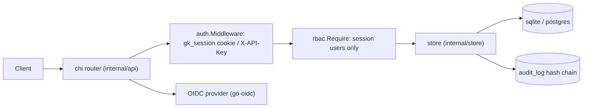

# Gatekeeper

Workforce IAM service: users, RBAC roles, API keys, sessions, OIDC SSO,
access-review campaigns with enforced revocation, a hash-chained audit log,
and SCIM provisioning. For teams that need a small self-hosted identity
control plane in front of internal tools.

Module `github.com/unveiledhistory49/gatekeeper` · Go `1.23.6` · router
`github.com/go-chi/chi/v5` · SQLite (default, `modernc.org/sqlite`) or
Postgres (`pgx/v5`).

## Architecture



`Auth.Middleware` resolves identity; `rbac.Require` enforces the
permission; handlers read/write via `store`, which talks to SQLite or
Postgres. OIDC login/callback shell out to the external provider.
Every mutation appends to the hash-chained `audit_log`.

## Quickstart

```bash
go build ./...
go run ./cmd/gatekeeper migrate
go run ./cmd/gatekeeper provision-org --name acme \
  --email admin@acme.test --password 'correct-horse-12'
# prints {"org_id":"...","user_id":"...","api_key":"gk_live_..."} — save the key

go run ./cmd/gatekeeper serve            # :8080
```

Login (sets the `gk_session` cookie and returns a `token`):

```bash
curl -i -X POST localhost:8080/v1/login \
  -H 'Content-Type: application/json' \
  -d '{"org_id":"ORG","email":"admin@acme.test","password":"correct-horse-12"}'
```

Authenticated calls use the session cookie. Stored API keys are org
identity only (`X-API-Key: gk_live_...`):

```bash
curl localhost:8080/v1/roles -H "X-API-Key: KEY" \
  -H 'Content-Type: application/json' -d '{"name":"viewer"}'
```

> **RBAC posture (verified in `internal/rbac/rbac.go`):** `Require`
> returns `403 "service keys cannot satisfy RBAC..."` for any identity
> with empty `UserID`. API keys are org-scoped with no roles and can
> never satisfy a permission check — automation that needs RBAC
> endpoints must use a user session token (`POST /v1/login`).

## Design decisions

- **Passwords:** argon2id (`time=3, memory=64MiB, threads=4, keylen=32`,
  16-byte salt, `$argon2id$v=19$...` unpadded base64). Minimum 12 chars
  (`auth.HashPassword` rejects shorter).
- **API keys:** minted `gk_live_<32 hex>` (16 random bytes); only
  `sha256hex(pepper + "::" + raw)` is stored, plus last-8-char prefix.
  Session tokens are 32 random bytes (hex), stored as `sha256hex(raw)`.
- **Audit chain:** gapless, app-assigned `seq` (`MAX(seq)+1` in a tx),
  each row `hash = sha256(prev || org || actor || action || target ||
  detail || seq || ts)`, `prev` = org tip or `genesis`. Tampering breaks
  `GET /v1/audit/verify` and `verify-audit` (`store.VerifyAuditChain`).
- **Revoke-before-decide:** `handleDecideItem` strips the role via
  `SetUserRoles` *before* `DecideReviewItem` records `revoked`, so a
  failure leaves the item retryable instead of decided-but-not-enforced.
- **No user delete:** users are `active`/`suspended` only (`PATCH
  /v1/users/{id}`, SCIM deprovisions suspend). Suspended users get 401.
- **Portable SQL:** queries use `?` placeholders; `db.Rebind` rewrites
  to `$n` for Postgres, passthrough for SQLite.

## Endpoints

Auth: `gk_session` cookie (session) or `X-API-Key` header (org identity).
All `/v1/*` below the first four require auth; guarded ones require the
listed permission (session only — API keys get 403).

| Method | Path | Permission |
| --- | --- | --- |
| GET | `/healthz` | public |
| POST | `/v1/login` | public (`org_id,email,password`) |
| GET | `/v1/oidc/login` | public (501 if OIDC unconfigured) |
| GET | `/v1/oidc/callback` | public (501 if OIDC unconfigured) |
| POST | `/v1/logout` | session/auth |
| GET | `/v1/me` | session/auth |
| POST | `/v1/users` | `users:write` |
| GET | `/v1/users` | `users:read` |
| GET | `/v1/users/{id}` | `users:read` |
| PATCH | `/v1/users/{id}` | `users:write` |
| POST | `/v1/users/{id}/roles` | `users:write` |
| POST | `/v1/roles` | `roles:write` |
| GET | `/v1/roles` | `roles:read` |
| POST | `/v1/roles/{id}/permissions` | `roles:write` |
| POST | `/v1/api-keys` | `keys:write` |
| GET | `/v1/api-keys` | `keys:read` |
| POST | `/v1/api-keys/{id}/revoke` | `keys:write` |
| POST | `/v1/reviews/campaigns` | `reviews:write` |
| GET | `/v1/reviews/campaigns` | `reviews:read` |
| GET | `/v1/reviews/campaigns/{id}/items` | `reviews:read` |
| POST | `/v1/reviews/items/{itemID}/decide` | `reviews:write` (`certified`/`revoked`) |
| POST | `/v1/reviews/campaigns/{id}/close` | `reviews:write` |
| GET | `/v1/audit` | `audit:read` |
| GET | `/v1/audit/verify` | `audit:read` |
| GET | `/scim/v2/Users` | `users:read` |
| POST | `/scim/v2/Users` | `users:write` |
| GET | `/scim/v2/Users/{id}` | `users:read` |

## CLI

Usage: `gatekeeper <provision-org|create-user|serve|migrate|verify-audit> [flags]`

| Subcommand | Flags |
| --- | --- |
| `provision-org` | `--name --email --password` (min 12), `--db` |
| `create-user` | `--org --email --password` (min 12), `--name --roles` (names/ids, comma-sep), `--db` |
| `serve` | `--db` (overrides `GATEKEEPER_DATABASE_URL`), `--addr` (overrides `GATEKEEPER_ADDR`) |
| `migrate` | `--db` |
| `verify-audit` | `--org` (required), `--db` |

## Env

| Var | Default |
| --- | --- |
| `GATEKEEPER_DATABASE_URL` | `sqlite://./gatekeeper.db` (`sqlite://...`, `postgres://...`) |
| `GATEKEEPER_ADDR` | `:8080` |
| `GATEKEEPER_PEPPER` | `dev-pepper-change-me` (change in prod) |
| `GATEKEEPER_SESSION_HOURS` | `12` |
| `GATEKEEPER_OIDC_ISSUER` | _(unset)_ |
| `GATEKEEPER_OIDC_CLIENT_ID` | _(unset)_ |
| `GATEKEEPER_OIDC_CLIENT_SECRET` | _(unset)_ |
| `GATEKEEPER_OIDC_REDIRECT_URL` | _(unset)_ |

OIDC is enabled only when all four OIDC vars are set.

## Quality

```bash
go test ./...
go vet ./...
gofmt -l .
govulncheck ./...
```

Note: `go test -race` may not run on hosts blocking ThreadSanitizer.

## Layout

```text
cmd/gatekeeper/main.go
internal/api/      (api.go, users.go, roles.go, keys.go, reviews.go, audit.go, oidc.go, scim.go)
internal/auth/     (auth.go: argon2id, API keys, sessions, OIDC, middleware)
internal/config/   (config.go: GATEKEEPER_ env)
internal/db/       (db.go: open sqlite/postgres, migrate, Rebind)
internal/rbac/     (rbac.go: Granted + Require)
internal/store/    (store.go: persistence, audit chain)
```

## Limitations

- SQLite is the default; fine for single-node, not multi-writer scale.
- OIDC needs an external provider (`..._ISSUER/CLIENT_ID/CLIENT_SECRET/REDIRECT_URL`); endpoints return `501 oidc not configured` otherwise.
- No TOTP/2FA yet; sessions are bearer tokens in the `gk_session` cookie.
- Single-node: audit `seq` is app-assigned (`MAX(seq)+1`); concurrent writers can conflict rather than merge cleanly.
